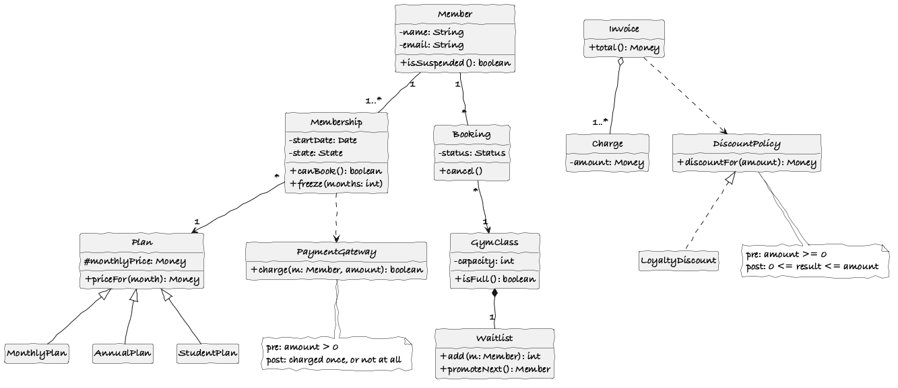
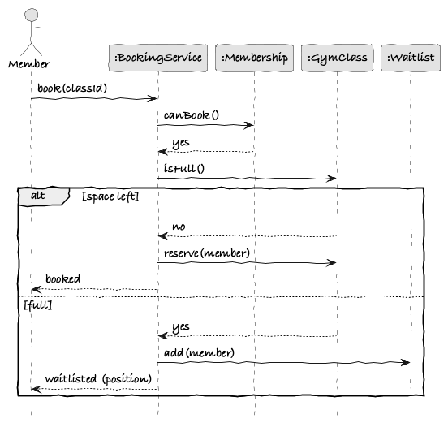
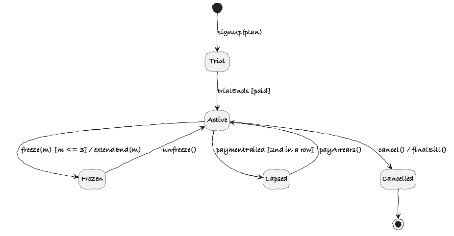
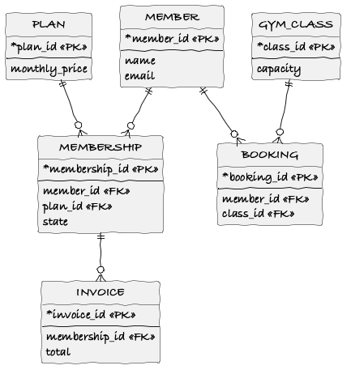

# Analysis sketches (report §6)

> **Bootstrap draft (GenAI, prompts #6–7 in [genai-prompts.md](../genai-prompts.md)).** The Systems Analyst should challenge these, redraw them by hand if preferred (the spec allows photographed sketches), and write the report text in our own words.

| Required by §6 | Diagram | Source |
| --- | --- | --- |
| Candidate objects | [below](#candidate-objects) | |
| Class diagram |  | [class-diagram.puml](class-diagram.puml) |
| Sequence diagram |  | [sequence-book-class.puml](sequence-book-class.puml) |
| State chart (object from the sequence diagram) |  | [membership-statechart.puml](membership-statechart.puml) |
| ER diagram with cardinality |  | [er-diagram.puml](er-diagram.puml) |

Render with `plantuml -tpng docs/analysis/*.puml` (needs Graphviz).

## Candidate objects

Found by noun identification (Lecture B method) over [UC1](../requirements/use-cases/UC1-sign-up-for-membership.md), [UC2](../requirements/use-cases/UC2-book-class.md) and the [business rules](../requirements/README.md#business-rules). Kept candidates have state, behaviour and identity.

| Noun | Source | Decision | Reason |
| --- | --- | --- | --- |
| Member, Prospective Member | UC1, UC2 | **Keep:** `Member` | Prospective Member is the same object before sign-up, so it isn't a separate class |
| Membership | UC1, BR-M2–M5 | **Keep** | Has a lifecycle (Trial → Active → ...), so it gets the state chart |
| Plan (Monthly, Annual, Student, Off-Peak) | BR-M1 | **Keep:** `Plan` with subclasses | Different pricing and access rules, so a generalisation |
| Trial, Active, Frozen, Lapsed, Cancelled | BR-M2–M4 | **Keep:** `MembershipState` subclasses | Behaviour varies by state (State pattern) |
| Freeze | BR-M3 | **Keep** | Needed to check "at most once per 12 months" |
| Class (timetable entry) | UC2, BR-B1 | **Keep:** `GymClass` | `Class` clashes with `java.lang.Class` |
| Timetable | UC2 | Discard | A query over `GymClass` by date, not an object |
| Waitlist | BR-B1, BR-B2 | **Keep** | Ordered, first-come first-served, promotes on cancel (Observer subject) |
| Booking | UC2, BR-B3–B6 | **Keep** | Links Member and GymClass and has its own status, so an association class |
| No-show, late cancellation | BR-B3, BR-B4 | Discard as classes | They are `BookingStatus` values and `ChargeType` values |
| Instructor | Actors | **Keep** | Teaches classes and records attendance (UC8) |
| Payment | UC1, BR-M4 | Discard as an entity | It's an outcome from the `PaymentGateway` port. `failedPayments` is kept on Membership |
| Payment Gateway | UC1 | **Keep** as an interface (`port.out`) | External system, so it sits behind a port |
| Price, fee, penalty, surcharge, credit | BR-P1 | **Keep:** `Charge` + `ChargeType` | One class, many kinds, so no duplicated attributes |
| Invoice | UC1, BR-P1 | **Keep** | Groups the charges for one period |
| Discount (Corporate, Family, Loyalty) | BR-P2 | **Keep:** `DiscountPolicy` | Interchangeable rules, best one wins (Strategy) |
| Referral, referral code | UC1, BR-P3 | Attribute + reflexive association on `Member` | The credit itself is a `Charge` of type `REFERRAL_CREDIT` |
| Student ID | BR-M1 | Attribute of `Member` | No behaviour of its own |
| Notification | UC1, BR-B2 | **Keep** as an interface (`NotificationSender`) | Delivered by an adapter (Observer listener) |
| Personal details, payment details | UC1 | Discard | Attributes, or handled outside the system |
| Front Desk Staff, Manager | Actors | Discard for now | Only roles for authorisation. No business state |

## Kept deliberately simple

These are analysis **sketches**, so they show only the main classes and a few attributes and operations each. Design patterns (State for `Membership`, Strategy for `DiscountPolicy`, Observer for `Waitlist`, Factory for `Plan`) are added in the design and implementation iterations, not here. All diagrams share one hand-drawn style from [style.iuml](../style.iuml).

## Checklist against the §6 marking criteria

- [x] Inheritance: `Plan` → `MonthlyPlan`, `AnnualPlan`, `StudentPlan`
- [x] Realisation: `LoyaltyDiscount` implements `DiscountPolicy`
- [x] Composition: `GymClass ◆ Waitlist`
- [x] Aggregation: `Invoice ◇ Charge`
- [x] Associations with multiplicity: `Member`–`Membership`, `Member`–`Booking`, `Booking` → `GymClass`, `Membership` → `Plan`
- [x] Dependencies: `Invoice` uses `DiscountPolicy`, `Membership` uses `PaymentGateway`
- [x] Visibility: `+`, `-`, `#`
- [x] Interfaces with pre/postconditions: `DiscountPolicy`, `PaymentGateway`
- [x] No duplicated attributes or operations
- [x] Sequence diagram contains `Membership`, the object with the state chart
- [x] State chart transitions annotated as `event [guard] / action`
- [x] ER diagram with crow's foot cardinality

## Open questions for the team

- Does a Trial membership pay at sign-up (UC1, step 6) or only when the trial ends (BR-M2)? The state chart assumes the trial becomes Active only once a payment has gone through.
- Should `Lapsed` time out to `Cancelled` automatically (e.g. after 60 days)? Not in the rules yet.
- Are family memberships in scope (UC1 open issue)? If so, `Member` needs a payer association.
