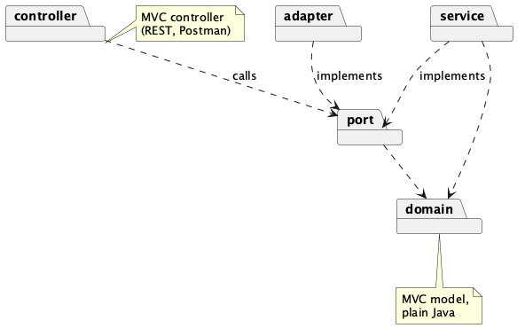

# Architecture (report §5)

> **Bootstrap notes (GenAI, prompts #6–7 in [genai-prompts.md](../genai-prompts.md)).** These are facts and decisions for the Architect, not report text. The report section (max 2 pages) must be written in our own words.

**Status:** pattern chosen 7 Oct 2026. MVC + **Hexagonal (Ports and Adapters)**, monolithic, one Spring Boot jar.

## Diagrams

| Diagram | Source | Purpose |
| --- | --- | --- |
|  | [package-diagram.puml](package-diagram.puml) | The required high-level package diagram. Every dependency points towards `domain` |

## Pattern 1: MVC (covered in lectures)

| MVC role | Our package | What lives there |
| --- | --- | --- |
| Model | `domain` (+ `service`) | Entities, business rules, the State/Strategy/Observer/Factory classes |
| View | `dto` | Request and response records, rendered as JSON for Postman. No HTML |
| Controller | `controller` | REST endpoints. Translate HTTP to use-case calls. No business rules |

This is MVC in its REST form: the "view" is the JSON representation, not a screen.

## Pattern 2: Hexagonal / Ports and Adapters (self-researched)

Source: Cockburn, A. (2005) *The Hexagonal (Ports & Adapters) Architecture*, HaT Technical Report 2005.02. Available at: https://alistair.cockburn.us/hexagonal-architecture

**Intent (Cockburn):** let the application be driven equally by users, programs, automated tests or batch scripts, and be developed and tested in isolation from its eventual run-time devices and databases.

| Hexagonal element | Our classes | Package |
| --- | --- | --- |
| Application (inside the hexagon) | Domain model + use-case services | `domain`, `service` |
| Driving (inbound) port | `SignUpUseCase`, `BookClassUseCase`, `RunBillingUseCase`, ... | `port.in` |
| Driving (inbound) adapter | REST controllers (Postman), `BillingJob` (clock), JUnit tests | `controller` |
| Driven (outbound) port | `Repository<T, ID>` and its bindings, `PaymentGateway`, `NotificationSender` | `port.out` |
| Driven (outbound) adapter | `JsonFile*Repository`, `FakePaymentGateway`, `EventNotificationSender` | `adapter.*` |

**Dependency rule:** `domain` depends on nothing. `service` depends on `domain` and the ports. Adapters depend inwards on the ports. Nothing in `domain` or `service` imports Spring web, Jackson or `java.io`. This can be checked automatically with an ArchUnit test, which is a candidate for §9 added value.

**How the two patterns fit together:** MVC organises the *driving* side (how a request reaches the application and how the answer is shown). Hexagonal organises the *whole* application around the domain, so MVC's controller turns into one adapter among several. JUnit tests and the billing clock drive the same ports as Postman does.

**Why Hexagonal for this scenario:**
- QA1 extensibility: a new plan or discount sits in `domain`. A new payment provider or a real database (Part 2) is a new adapter, with no changes to the core.
- QA2 testability (if chosen): every business rule runs with in-memory fakes behind the outbound ports. No files, no HTTP, and a fixed `Clock`.
- The spec allows a simulated front end and file I/O. Hexagonal makes "simulated" an adapter swap rather than a hack.
- It sets up Part 2 (microservices), where each service keeps the same hexagon around its own domain.

**Liabilities to discuss:** more interfaces and indirection than plain layering. A mapping step between DTOs, domain objects and JSON documents. It's easy to let Spring annotations leak into `domain`.

**Alternatives considered (7 Oct 2026):**
- Microkernel / Plug-in: strongest on extensibility, but overlaps with Strategy at our scale.
- Pipes and Filters: fits the billing run (BR-P1) but covers only one feature.
- Service Layer + Data Mapper: a well-known enterprise default, so it shows less independent research.

## Hosting stack

From [tech-stack.md](../tech-stack.md#hosting-stack-report-5):

| Tier | Technology |
| --- | --- |
| Web server + application server | Tomcat, embedded in the Spring Boot jar |
| Business tier | `domain` + `service` (the hexagon) |
| EIS / database | JSON files, reached only through `adapter.persistence` |
| Message bus | Spring `ApplicationEventPublisher` (in-process), used by `adapter.notification` |

## Package structure

```
gym/
+- GymApplication
+- controller/              inbound adapters: MembershipController, BookingController, BillingController, MemberController
+- dto/                     request and response records (MVC view)
+- port/in/                 use-case interfaces: SignUpUseCase, BookClassUseCase, ...
+- port/out/                Repository<T, ID>, MembershipRepository, GymClassRepository, ..., PaymentGateway, NotificationSender
+- service/                 implements port.in: MembershipService, BookingService, BillingService, MemberService
+- domain/                  Member, Membership, MembershipState (+ states), Plan (+ plans), GymClass, Waitlist, Booking, Charge, Invoice, DiscountPolicy (+ policies)
+- adapter/persistence/     JsonFileMembershipRepository, ...
+- adapter/payment/         FakePaymentGateway
+- adapter/notification/    EventNotificationSender
```

This is still package by layer, so it stays monolithic. Each member owns one feature's classes across every package (see [roles.md](../roles.md)).
