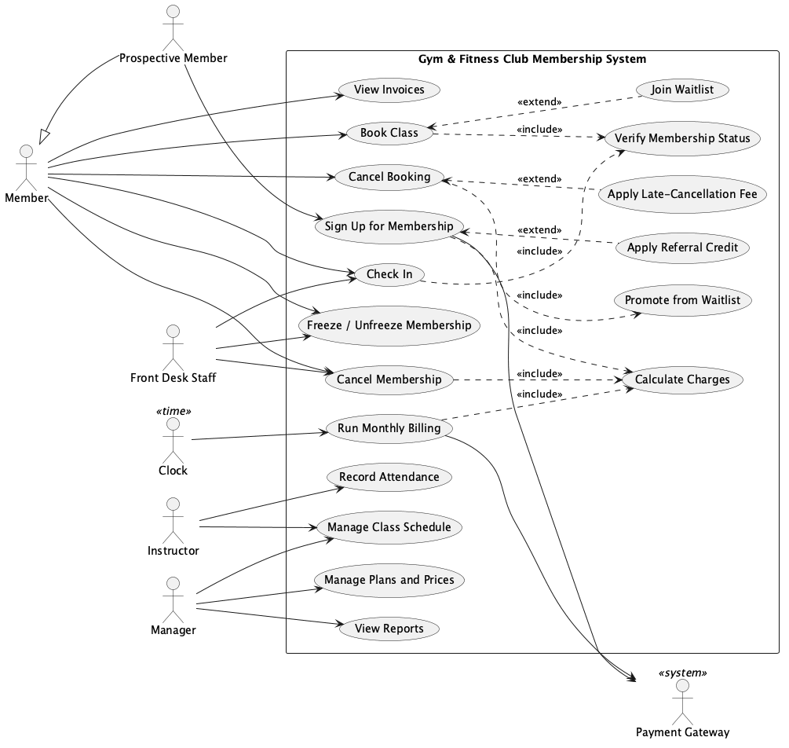

# Requirements (report §4)

> **Bootstrap draft (GenAI, prompt #2 in [genai-prompts.md](../genai-prompts.md)).** This is a starting point for the Business Analyst. Challenge it, change it, and write the report text in our own words.

## Actors

| Actor | Kind | Notes |
| --- | --- | --- |
| Member | Primary | Holds a membership, books classes, checks in |
| Prospective Member | Primary | Specialises Member in the diagram (actor generalisation) for sign-up only |
| Front Desk Staff | Primary | Checks members in, handles freezes and cancellations on their behalf |
| Instructor | Primary | Runs classes, marks attendance (no-shows) |
| Manager | Primary | Manages plans, prices and the class schedule, views reports |
| Payment Gateway | Secondary | External system that charges cards |
| Clock / Scheduler | Secondary (time) | Triggers the monthly billing run and the membership expiry checks |

## Use cases

| ID | Use case | Actor(s) | Relationships |
| --- | --- | --- | --- |
| UC1 | **Sign Up for Membership** ★ | Prospective Member, Payment Gateway | `<<include>>` Calculate Charges; `<<extend>>` Apply Referral Credit (a referral code is given) |
| UC2 | **Book Class** ★ | Member | `<<include>>` Verify Membership Status; `<<extend>>` Join Waitlist (the class is full) |
| UC3 | Cancel Booking | Member | `<<extend>>` Apply Late-Cancellation Fee (less than 2 hours before the class); `<<include>>` Promote from Waitlist |
| UC4 | Check In | Member, Front Desk Staff | `<<include>>` Verify Membership Status |
| UC5 | Freeze / Unfreeze Membership | Member, Front Desk Staff | |
| UC6 | Cancel Membership | Member, Front Desk Staff | `<<include>>` Calculate Charges (final bill) |
| UC7 | Run Monthly Billing | Clock, Payment Gateway | `<<include>>` Calculate Charges |
| UC8 | Record Attendance | Instructor | Records no-shows, which BR-B4 penalises |
| UC9 | Manage Plans and Prices | Manager | |
| UC10 | Manage Class Schedule | Manager, Instructor | |
| UC11 | View Invoices | Member | |
| UC12 | View Reports (occupancy, revenue) | Manager | |

★ = the 2 key use cases for full descriptions: [UC1](use-cases/UC1-sign-up-for-membership.md) and [UC2](use-cases/UC2-book-class.md).

## Business rules

These make the system "compute intense" rather than CRUD. All values are placeholders.

**Membership (M)**
- **BR-M1:** Plans are Monthly (€45), Annual (€450, paid upfront), Student (€30/month, needs a valid student ID), and Off-Peak (€30/month, check-in only 10:00–16:00 on weekdays).
- **BR-M2:** A new member starts a 7-day Trial with a limit of 2 class bookings, then becomes Active once the first payment succeeds.
- **BR-M3:** A membership can be frozen for 1–3 months, at most once per 12 months. It is not billed while frozen, and the end date moves forward by the freeze length.
- **BR-M4:** Two failed payments in a row make the membership Lapsed, which blocks check-in and booking. Paying the arrears restores it to Active.
- **BR-M5:** Annual plans can't be cancelled within the first 6 months without a €50 early-exit fee.

**Booking (B)**
- **BR-B1:** Each class has a capacity. Once it is full, new requests join a first-come, first-served waitlist.
- **BR-B2:** When a booking is cancelled, the first person on the waitlist is promoted automatically and notified.
- **BR-B3:** Cancelling less than 2 hours before the class costs a €5 late-cancellation fee. Trial members aren't charged the fee, but it counts against their 2 bookings.
- **BR-B4:** A no-show costs €5, and 3 no-shows in 30 days suspend booking for 7 days.
- **BR-B5:** Members can hold at most 5 future bookings. Off-Peak members can book off-peak classes only.
- **BR-B6:** Premium classes (e.g. reformer Pilates) have a €8 surcharge unless the member is on the Annual plan.

**Billing (P)**
- **BR-P1:** The monthly charge is the plan price, minus discounts, plus penalties (late cancellations, no-shows, premium surcharges), minus referral credits.
- **BR-P2:** Discounts don't stack: the best one applies. Corporate 15%, Family (second member onward) 10%, Loyalty (more than 24 months) 5%.
- **BR-P3:** Each successful referral gives the referrer €20 credit, applied to future bills and capped at €60 per year.
- **BR-P4:** Joining mid-month is pro-rated by days remaining.

## Quality attributes

**QA1: Extensibility (mandatory).** Example scenario: *a developer adds a new plan type (e.g. "Weekend Only") with its own pricing and access rules, changing no existing class and without touching billing or booking code, in under 1 day.*
Relevant tactics (Bass et al., modifiability): increase cohesion (split responsibilities), reduce coupling (encapsulate, use an intermediary, abstract common services), and defer binding (polymorphism, registration or configuration of plans and discount policies). These map to Strategy for pricing, State for the lifecycle, and Factory for plan creation.

**QA2: choose one**, for example:
- *Performance:* the monthly billing run for 10,000 members finishes in under 30 seconds. Tactics: increase efficiency, introduce concurrency, bound execution time.
- *Testability:* every business rule is unit-testable without I/O. Tactics: specialised interfaces, dependency injection of repositories and the clock, limiting nondeterminism.

## GUI prototypes (2 needed)

Candidates:
1. **Book a Class**: the member's weekly timetable, showing capacity, "Book" or "Join waitlist" buttons, and any premium surcharge.
2. **Front-desk Check-in**: scan or search a member, then show membership state (Active / Frozen / Lapsed / Trial), off-peak restriction and outstanding balance.
